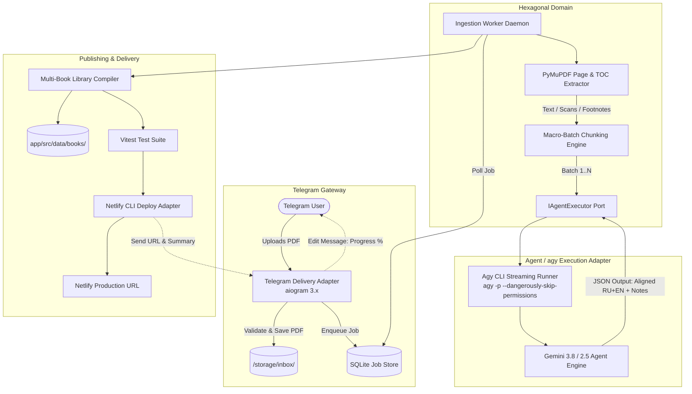

# ADR-002: Architecture for Automated Book Ingestion via Telegram Bot & agy CLI

## Status
Proposed / Under Evaluation

## Context & Motivation
The user desires an automated pipeline to expand the academic digital reader:
1. The user uploads a book (primarily in **PDF** format, either digital text or scanned pages) via a **Telegram Bot** from any device (phone, laptop).
2. The system receives the document, ingests and pre-processes it (extracting text, outlines, chapter hierarchies, footnotes, and page scans).
3. The system leverages **Antigravity CLI (`agy`)** and AI agent capabilities to perform high-accuracy theological academic translation, footnote-to-text alignment, and structured metadata extraction.
4. The output is compiled into the reader's canonical `BookManifest` format, integrated into the web library, verified via automated test suite, and deployed to production via Netlify CLI.
5. The user receives real-time progress tracking in Telegram with a final link to the deployed book in the reader.

---

## Architectural Options Considered

### Option 1: Direct Subprocess Script (`agy -p` CLI Subprocess Runner)
* **Design**: A single Telegram bot process that receives files and directly spawns `agy -p "..."` via shell subprocesses for each page or batch.
* **Pros**: Simple to set up initially, uses existing CLI installation.
* **Cons / Dispute**:
  * **Critical Flaw**: Spawning a full `agy` CLI process per batch incurs massive startup overhead (loading skills, configurations, MCPs each time).
  * **Process Blocking**: Telegram webhook/polling loop risks getting blocked or timing out during long-running subagent tasks.
  * **Failure Recovery**: If a subprocess fails or the server restarts mid-book, there is no job state, requiring complete re-ingestion.

### Option 2: Monolithic In-Process Procedural Bot
* **Design**: A monolithic Python bot with embedded PDF extraction, inline prompt execution, and direct file writing in one loop.
* **Pros**: No separate worker processes or database.
* **Cons / Dispute**:
  * Violates our Clean / Hexagonal Architecture standards.
  * Zero unit testability without running live Telegram connections.
  * Telegram rate-limiting and connection drops abort the whole translation.
  * High risk of memory leaks when processing 100+ MB PDFs.

### Option 3: Daemon Socket / IPC (`agy remote-control`)
* **Design**: Run `agy remote-control` daemon and communicate via internal IPC / socket.
* **Pros**: Keeps an agent instance running in memory.
* **Cons / Dispute**:
  * `agy remote-control` is designed for remote CLI terminal multiplexing, not an idempotent batch-processing RPC API.
  * Unstable internal protocols subject to breaking changes.
  * Lacks built-in task queuing, retries, and persistence.

### Option 4 (RECOMMENDED): Hexagonal Asynchronous Ingestion Engine (Queue + Worker + agy Batch Adapter + Multi-Book Library)
* **Design**:
  * **Delivery Layer (Telegram Adapter)**: Asynchronous bot (`aiogram 3.x`) handles file uploads, validation (size/format), authentication (whitelisted `TELEGRAM_ADMIN_ID`), and renders interactive status messages with progress bars.
  * **Application / Queue Layer**: Lightweight SQLite-backed Job Queue (`LiteQueue` / `RQ`). Persists job lifecycle (`QUEUED`, `EXTRACTING`, `TRANSLATING_BATCH_N`, `COMPILING`, `DEPLOYED`, `FAILED`).
  * **Core Domain (Pure Hexagonal Logic)**:
    1. *Document Analyzer*: Deterministic Python parser (`PyMuPDF / fitz`) extracts vector text, TOC hierarchy, and embedded images; detects if pages are text-based or raster scans.
    2. *Batch Chunking Engine*: Splits 20–200 pages into optimal macro-batches (5–10 pages per batch) with overlap context.
    3. *Footnote & Align Resolver*: Parses footnote markers, anchors them to source paragraphs, and enforces paired schema (`en` + `ru`).
  * **Infrastructure / Model Adapter (`IAgentExecutor`)**:
    * Clean interface for agent execution.
    * Implementation: `AgyCliBatchRunner` executing `agy --prompt-interactive` or `agy -p` in structured stream JSON mode with `--dangerously-skip-permissions`, feeding batches into subagent prompt templates.
  * **Publishing Port**:
    * Compiles canonical `PageData[]` and updates `app/src/data/libraryManifest.ts`.
    * Runs Vitest test suite (`npm test`).
    * Deploys via Netlify CLI (`npx netlify deploy --prod`).
    * Sends completion notification with direct URL to the Telegram chat.

---

## Comparative Trade-off Matrix

| Metric | Option 1 (Direct Subprocess) | Option 2 (Monolithic Bot) | Option 3 (IPC Daemon) | Option 4 (Hexagonal Async Queue - Recommended) |
| :--- | :--- | :--- | :--- | :--- |
| **Resilience & Fault Tolerance** | Low (fails on timeout) | Very Low (blocks bot loop) | Medium (socket dependency) | **Very High (persisted SQLite state, retry per batch)** |
| **Clean Architecture & Testability** | Poor (coupled to OS shell) | None (monolith) | Poor (coupled to socket) | **Excellent (Domain, Ports & Adapters isolated)** |
| **Telegram Responsiveness** | Poor (freezes or drops) | Fails on long books | Medium | **Instant (Async ACK + live editing progress message)** |
| **Multi-Book Scalability** | Ad-hoc overwrites | Ad-hoc | Ad-hoc | **Modular (Multi-book library schema with slug routing)** |
| **Operational Simplicity** | High (few files) | High | Low | **Balanced (Single Python virtualenv + SQLite, zero Redis needed)** |

---

## Recommended Solution: Detailed Architectural Blueprint (Option 4)

---

## Next Steps for Implementation
1. **Frontend**: Extend Reader to support a Multi-Book Library switcher (`/books/:slug` or book selector).
2. **Backend**: Implement Python Telegram bot with `aiogram` + SQLite queue.
3. **Core Parser**: Implement `pdf_extractor.py` using `fitz` (PyMuPDF) to handle vector text and fallback raster scans.
4. **Agent Integration**: Implement `agy_runner.py` with structured input/output JSON schemas and error handling.
5. **Security**: Whitelist specific `TELEGRAM_USER_ID` to prevent unauthorized usage and quota consumption.
