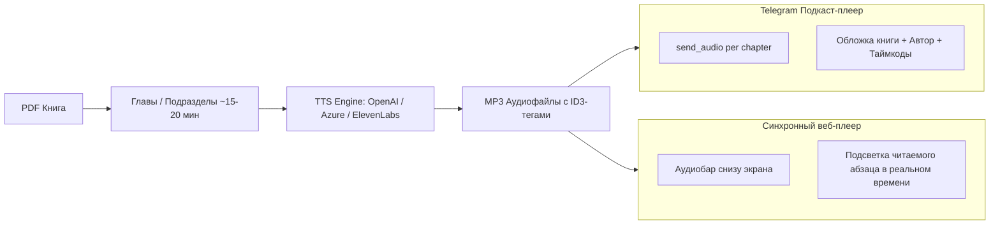

# Архитектура аудиокниг (TTS) для веб-читалки и Telegram: Расчет стоимости и альтернативы

> **Назначение документа:** Детальный экономический, временной и технический расчет создания аудиокниги объемом 500 страниц (~1 000 000 – 1 200 000 символов) через **ElevenLabs** и альтернативные движки (OpenAI, Azure, Kokoro-82M, XTTS), а также схема интеграции в Telegram-бота и веб-интерфейс.

---

## 1. Базовые метрики книги объемом 500 страниц

Для книги академического формата (например, Грант Осборн «Герменевтическая спираль» или Томас Шрейнер «Богословие Нового Завета»):

- **Количество страниц:** 500 стр.
- **Слов на страницу:** ~260–280 слов.
- **Общий объем текста:** ~130 000 – 140 000 слов.
- **Объем в символах с пробелами:** **~1 000 000 – 1 150 000 символов** (без сносок и библиографии — около 950 000 символов).
- **Скорость дикторского чтения:** 130–150 слов в минуту (~8 000 – 9 000 слов в час).
- **Итоговый хронометраж аудиокниги:** **~17 – 20 часов чистого звучания**.

---

## 2. ElevenLabs: Детальный расчет стоимости и времени

ElevenLabs считается отраслевым золотым стандартом по естественности интонаций, паузам и эмоциональному богатству голоса (модель `Eleven Multilingual v2`).

### Тарифная сетка ElevenLabs (для коммерческого API)
- **Free Tier:** 10 000 символов в месяц (хватит только на 4–5 страниц).
- **Starter ($5/мес):** 30 000 символов.
- **Creator ($22/мес):** 100 000 символов.
- **Pro Tier ($99/мес):** Включает **500 000 символов**. Сверх лимита — **$0.18 за 1 000 символов** ($180 за 1 млн).
- **Scale Tier ($330/мес):** Включает **2 000 000 символов**.

### Расчет стоимости книги в 500 страниц (1 100 000 символов):
1. **Вариант 1 (Pro Tier):**
   - Базовая подписка (1 месяц): **$99** (покрывает 500 000 символов).
   - Дополнительные 600 000 символов: 600 × $0.18 = **$108**.
   - **Итоговая стоимость одной книги:** **$207** (~95 000 ₸ / ~19 000 ₽).
2. **Вариант 2 (Scale Tier):**
   - Месячная подписка **$330** (покрывает 2 000 000 символов).
   - На этом тарифе можно озвучить почти **две полные книги по 500 страниц** (~$165 за книгу).

### Время генерации в ElevenLabs:
- ElevenLabs генерирует аудио со скоростью **~5x–10x от реального времени** (1 минута аудио генерируется за 6–10 секунд).
- 20 часов аудио потребуют суммарно **~2 – 3 часа чистого времени API-генерации**.
- **Ограничения API:** Максимальная длина одного запроса — 5 000 символов. Книга разбивается на ~220 чанков (по подразделам или страницам).
- При 3 параллельных потоках генерации полная аудиокнига синтезируется и собирается за **45–60 минут**.

---

## 3. Сравнение всех альтернатив (ElevenLabs vs OpenAI vs Azure vs Open-Source)

| Сервис / Модель | Качество голоса | Поддержка языков | Стоимость за 500 страниц (1.1M знаков) | Время генерации | Доступность и автономность |
| :--- | :--- | :--- | :--- | :--- | :--- |
| **ElevenLabs Multilingual v2** | 🌟 10/10 (Студийный дубляж, живое дыхание) | 🇷🇺 Русский (отлично)<br>🇬🇧 Английский (эталон)<br>🇰🇿 Казахский (экспериментальный) | **~$207** | 45–60 мин | Облачное API, строгие квоты |
| **OpenAI TTS (`tts-1` / `tts-1-hd`)** | 🌟 8.5/10 (Четкая, приятная дикторская речь) | 🇷🇺 Русский (отлично)<br>🇬🇧 Английский (отлично)<br>🇰🇿 Казахский (базовый) | **$16.50** (`tts-1`)<br>**$33.00** (`tts-1-hd`) | 20–30 мин | Облачное API (в 12 раз дешевле ElevenLabs!) |
| **Microsoft Azure Neural TTS** | 🌟 9/10 (Идеальная орфоэпия, академический тон) | 🇷🇺 Русский (Dmitry, Svetlana)<br>🇬🇧 Английский (Guy, Jenny)<br>🇰🇿 **Казахский (Aigul, Daulet — лучший в мире)** | **$17.60** ($16 за 1M знаков) | 25–35 мин | Облачное API Azure |
| **Kokoro-82M (Open-Source)** | 🌟 8.5/10 (Удивительное качество при 82M весов) | 🇬🇧 Английский (отлично)<br>🇷🇺 Русский (хорошо, сообщество) | **$0.00 (Бесплатно)** | ~1.5–2 часа на обычном GPU | Локально на сервере, полная автономность |
| **Coqui XTTS-v2 (Open-Source)** | 🌟 8/10 (Клонирование любого голоса по образцу 6с) | 🇷🇺 Русский, 🇬🇧 Английский, 17+ языков | **$0.00 (Бесплатно)** | ~3 часа на GPU (RTX 3060/4090) | Локально на сервере, без ограничений |

---

## 4. Экспертная рекомендация по выбору стека

1. **Для русского и английского языков при балансе цена/качество:**
   👉 **OpenAI TTS (`tts-1-hd`, голоса `onyx` или `echo`)**: Стоимость всего **$33** за огромную книгу в 500 страниц. Звучание глубокое, академическое, дикторское, без запинок.
2. **Для казахского языка (Қазақ тіліндегі теологиялық кітаптар):**
   👉 **Microsoft Azure Cognitive Speech (`kk-KZ-DauletNeural` / `kk-KZ-AigulNeural`)**: Единственный в мире движок промышленного уровня с безупречным произношением специфических казахских звуков (`ә, ғ, қ, ң, ө, ұ, ү, һ, і`). Стоимость: **~$17.50** за книгу.
3. **Для премиального флагманского издания:**
   👉 **ElevenLabs (Voice Cloning известного чтеца)**: **~$200** за книгу.
4. **Для бесплатного масштабирования библиотеки (100+ книг):**
   👉 **Kokoro-82M / Piper TTS** на собственном GPU-сервере (**$0 затрат на API**).

---

## 5. Архитектура интеграции аудио в Telegram и Веб-читалку



### Подача через Telegram-бот (`@pdf_to_web_book_bot`):
- Книга нарезается по главам (по 15–30 минут, файл 15–25 МБ).
- Бот высылает главу как нативный аудиофайл Telegram с метаданными:
  ```python
  await bot.send_audio(
      chat_id=chat_id,
      audio=types.FSInputFile(chapter_mp3_path),
      title="Глава 1. Контекст как определяющий фактор",
      performer="Грант Р. Осборн",
      caption="🎧 <b>Аудиоверсия: Герменевтическая спираль</b>\nГлава 1 (стр. 38–64)",
      parse_mode="HTML"
  )
  ```
- Пользователь может слушать в фоне, в машине, менять скорость (1.5x / 2x) прямо в Telegram без сторонних приложений.

### Подача в Веб-читалке:
- Плавающий аудиоплеер внизу страницы читалки.
- Наличие таймкодов (WebVTT) позволяет нажать на значок 🔊 рядом с любым абзацем и сразу начать прослушивание с этого конкретного места.
