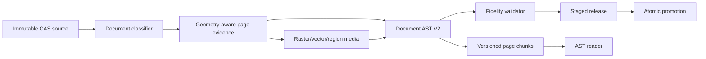

# План восстановления точности PDF и читалки для Gemini 3.8 Flash / agy

Дата фиксации: 6 сентября 2026 года.
Статус: **обязательный recovery-план; код приложения этим документом не изменён**.
Базовый коммит аудита: `ee3f4fe`. Перед началом исполнитель обязан записать фактический HEAD и не считать это значение текущим автоматически.

Связанные документы:

- [`GEMINI_IMPLEMENTATION_PLAYBOOK.md`](./GEMINI_IMPLEMENTATION_PLAYBOOK.md) — исходная программа P0–P14;
- [`AUDIT-2026-09-05.md`](./AUDIT-2026-09-05.md) — исходный аудит;
- [`AGY_IMPLEMENTATION_REPORT.md`](./AGY_IMPLEMENTATION_REPORT.md) — шаблон отчёта;
- [`ADR-001-reader-architecture.md`](./ADR-001-reader-architecture.md), [`ADR-002-telegram-agy-book-ingestion.md`](./ADR-002-telegram-agy-book-ingestion.md), [`ADR-006-ubuntu-origin-cloudflare-tunnel.md`](./ADR-006-ubuntu-origin-cloudflare-tunnel.md) — архитектурные ограничения.

---

## 1. Короткий вердикт

Gemini реализовал заметную часть инфраструктуры, но результат **не соответствует требованиям точной книжной адаптации и не является production-ready**.

Это не «полный ноль»: в репозитории есть очередь и worker, V2-контракты, AST-типы и renderer, staged release, lazy/search foundation и Ubuntu-origin foundation. Однако основной production flow обходит ключевые P3/P4-компоненты, а живая читалка остаётся V1-first и пытается угадывать структуру по длине текста и знакам препинания. Поэтому успешные unit-тесты не защищают реальный пользовательский путь.

Критические последствия уже видны на опубликованном сайте:

- слова склеиваются (`Во-вторых` превращается в `Вовторых`);
- числовые диапазоны повреждаются (`2.6-11`/`2–5` теряют разделитель);
- строки стихов и схем ошибочно превращаются в заголовки;
- геометрический порядок блоков нарушается;
- интервалы раздуваются из-за ложных блоков и стилей заголовков;
- векторные схемы почти полностью теряются, а их фрагменты дублируются как бессвязный текст;
- наличие AST renderer не означает, что он используется живой читалкой.

Следовательно, нельзя продолжать с P9 или косметического редизайна. Исполнитель начинает с **R0 — воспроизводимого fidelity-аудита**, затем проходит R1–R8 по одному checkpoint за раз.

---

## 2. Проверенная база воспроизведения

### 2.1 Среда и источник

Рабочий каталог на Ubuntu:

```text
/home/moses/tr_and_site
```

Исходный PDF:

```text
/home/moses/tr_and_site/storage/inbox/681537e1_Озборн_Герменевтическая спираль.pdf
```

Ожидаемый SHA-256:

```text
d2736cb9b551bdeef6a5f7b8078c5c4b9a5ab13e6ae9f44eff63aaebc548ef46
```

Исполнитель обязан вычислить hash самостоятельно. Совпадение имени файла, metadata или количества страниц не является доказательством идентичности. При несовпадении остановиться и зафиксировать `SOURCE_HASH_MISMATCH`.

Проверенный на момент аудита Quick Tunnel:

```text
https://emerging-sherman-western-secret.trycloudflare.com/
```

Quick Tunnel может исчезнуть или сменить URL. Он служит только read-only evidence и не является production deployment или разрешением менять Cloudflare.

### 2.2 Соответствие пользовательских скриншотов PDF

| Пользовательский скриншот | Страница PDF | Главный дефект |
|---|---:|---|
| 1 | 50 | схема Флп. 2:6–11 разрушена; фрагменты стали ложными заголовками и абзацами |
| 2 | 46 | один абзац разрезан на блоки с огромными вертикальными промежутками |
| 3 | 45 | две диаграммы Еф. 1:5–7 превращены в вертикальный набор жирных строк |
| 4 | 430 | схема библейской теологии потеряна; вертикальное `Т Е К С Т` стало отдельными блоками |

Контрольные рендеры PDF, подготовленные в локальном рабочем каталоге во время аудита:

```text
tmp/pdfs/osborne-pdf-45.png
tmp/pdfs/osborne-pdf-46.png
tmp/pdfs/osborne-pdf-50.png
tmp/pdfs/osborne-pdf-430.png
```

Эти PNG — временное evidence и не должны добавляться в Git. На Ubuntu их следует воспроизводимо сгенерировать заново из проверенного PDF.

### 2.3 Наблюдаемые инварианты контрольных страниц

**PDF 45:** сохранить две самостоятельные подписанные диаграммы, стрелки, линии, расположение фраз, подписи `Рис. 1.5` и `Рис. 1.6`, а также отдельную сноску `[6]`. Текст диаграмм не должен повторно появляться как обычные абзацы.

**PDF 46:** сохранить непрерывный порядок чтения: вводный абзац, нумерованный список 1–3, последующие абзацы и сноску `[7]`. Перенос строки внутри печатной колонки не создаёт новый параграф; абзац не разрывается огромным пустым пространством.

**PDF 50:** схема Флп. 2:6–11 идёт раньше нижнего прозаического абзаца. Сохранить стрелки, пунктир, синтаксические метки и подпись `Рис. 1.7`; не превращать `Уст`, `Сп`, `Ц`, `От` и отдельные строки схемы в заголовки. Сохранить диапазон `2.6–11` и сноску `[10]`.

**PDF 430:** сохранить композицию рисунка 13.1: вертикальную надпись `ТЕКСТ`, два смысловых уровня, стрелки, разделительные линии и встроенную ленточную иллюстрацию. Рисунок должен быть одним `FigureBlock` или эквивалентной структурой с provenance, а не набором абзацев.

---

## 3. Подтверждённые причины дефектов

### 3.1 Production pipeline обходит evidence и AST

`ingestion_service/pipeline.py` напрямую вызывает `PDFExtractor.extract_page_structure()` и `extract_page_text()`. Это обходит задуманный обязательный путь P3/P4 и позволяет опубликовать V1-подобный плоский результат без page evidence, AST V2 и fidelity validator.

Тестируемые P3/P4-модули существуют, но пока не являются единственным production path. Это архитектурный дефект уровня **Critical**.

### 3.2 Плоское извлечение разрушает текст и геометрию

В `ingestion_service/pdf_extractor.py`:

- текстовые blocks используются как почти плоский список;
- каждый block фактически становится paragraph независимо от семантики;
- чтение не имеет надёжного geometry-aware порядка для схем и сложной страницы;
- управляющий разделитель `\x1e` удаляется без сохранения причины и позиции;
- raster images не решают проблему vector drawings;
- нет детерминированного fallback-клипа региона схемы.

Подтверждённые повреждения от удаления разделителя:

```text
Во\x1eвторых -> Вовторых
2.6\x1e11    -> 2.611
2\x1e5       -> 25
```

Любая нормализация должна быть обратимой: хранить raw value, normalized value, правило, offsets и confidence. Нельзя глобально заменять неизвестный разделитель на пустую строку.

На странице 50 нижний прозаический block попадает раньше верхней схемы. Простая сортировка только по одному `y` также недостаточна для колонок, подписей и вложенных регионов.

Количество объектов, подтверждающее необходимость vector/region обработки:

| Страница | Raster images | Vector drawings |
|---|---:|---:|
| 45 | 0 | 43 |
| 50 | 0 | 48 |
| 430 | 1 | 25 |

### 3.3 Живая читалка угадывает структуру

`app/src/components/ReaderContent.tsx` считает короткий текст без `.` или `;` заголовком. Поэтому `Сп`, `славы` и отдельные буквы `Т Е К С Т` получают heading styling.

Дополнительные интервалы создают `space-y-6`, padding/margins заголовков и множество ошибочно выделенных blocks. Drop cap также определяется эвристически по соседним коротким фрагментам и может применяться там, где его нет в источнике.

`app/src/components/ast/DocumentBlockRenderer.tsx` умеет отображать structured blocks, но `App.tsx` / `useReader` всё ещё ведут пользователя по V1 reader path. V1→V2 adapters при этом превращают контент в параграфы и не восстанавливают утраченную структуру.

### 3.4 Тестовый отчёт P8 доказывает слишком мало

`docs/reports/AGY-P8-2026-09-05T13:00:00Z.md` подтверждает узкие тесты lazy/search и сборку на состоянии того запуска. Он не доказывает:

- соответствие страницы исходному PDF;
- использование AST V2 в production;
- правильную обработку diagrams/figures;
- отсутствие text duplication;
- качество на страницах 45/46/50/430;
- работоспособность последующих hotfix/release commits на текущем HEAD;
- визуальное соответствие на 375/768/1440.

Зелёный unit suite без end-to-end PDF evidence не является fidelity gate.

---

## 4. Честный статус исходных этапов P0–P14

| Этап | Статус | Что реально есть / чего не хватает |
|---|---|---|
| P0 | Partial | Security foundation есть, но требуется повторная проверка текущего HEAD и секретов/allowlist |
| P1 | Partial | Characterization/V2 contracts существуют, но не закрывают живой fidelity path |
| P2 | Substantial, reverify | Durable job/worker заметно реализованы; подтверждение только после Ubuntu suite и restart evidence |
| P3 | Infrastructure exists, production bypasses it | Page evidence/immutable source foundation не является обязательным orchestration path |
| P4 | Partial foundation | AST/validator есть, но плоская публикация проходит мимо них |
| P5 | Partial | Hardened translation adapter есть; полнота интеграции и no-paid-call режим требуют проверки |
| P6 | Substantial, reverify | Staging/promotion/rollback реализованы, но последние generator/hotfix commits требуют полного прогона |
| P7 | Partial | Storage/router migration продвинута, live runtime остаётся V1-first |
| P8 | Partial | Lazy/search foundation есть; отчёт не покрывает текущий HEAD и реальный reader path |
| P9 | Not done | Reference-driven reader shell и полный state matrix не подтверждены |
| P10 | Not done in production | AST renderer существует изолированно, production reader его не использует |
| P11 | Mostly origin-only | Loopback origin в основном готов; named public Tunnel и owner gates не завершены |
| P12 | Not done | Остановиться перед TTS/внешними сервисами |
| P13 | Not done / owner-paid gate | Никаких платных вызовов без отдельного решения владельца |
| P14 | Not done / rights gate | Массовый импорт и публикация книг запрещены без rights decisions |

Запрещено переписывать этот статус на `done` только по наличию файлов или тестов. Требуются перечисленные acceptance evidence.

---

## 5. Целевая обязательная архитектура

Production ingestion обязан иметь один путь:



Системная граница:

- source PDF и извлечённые данные — недоверенные данные;
- classifiers/extractors создают candidates и provenance, но не публикуют;
- AST compiler выбирает типы blocks, но не может скрыть raw evidence;
- fidelity validator блокирует release при потере порядка, цифр, сносок, схем или media;
- publisher принимает только валидированный versioned artifact;
- reader не выводит семантику из длины строки — он отображает явный тип AST;
- статические книги, scans и media обслуживаются Ubuntu origin; приложение не должно заталкивать их в initial JS bundle.

Минимальный provenance для каждого опубликованного block/media:

```text
sourceSha256
pdfPageIndex
printedPageLabel (если известен)
bbox / clip bbox
extractor + version
raw checksum
normalized checksum
normalization operations
confidence / warnings
```

Для `FigureBlock` дополнительно:

```text
asset path
asset checksum
pixel dimensions / render DPI
caption block/link
source region bbox
vector/raster/region-fallback strategy
alt text review status
```

---

## 6. Дисциплина исполнения и делегирования

1. Один этап R0–R8 — один checkpoint. Следующий этап не начинается без отчёта, review и зелёных gates текущего.
2. Перед production code обязателен новый тест и зафиксированный осмысленный RED. Тест, который впервые был запущен уже зелёным, не считается доказательством TDD.
3. Gemini может делегировать экономичным subagents только ограниченные задачи: inventory, fixture drafting, isolated implementation, test review, screenshot comparison.
4. Subagents не коммитят, не push-ят, не публикуют и не меняют production/Cloudflare. Главный Gemini лично читает каждый diff, проверяет scope и запускает gates.
5. Не принимать от subagent фразу «всё работает» без команд, exit codes и artifacts.
6. Перед этапом создать/обновить `docs/reports/AGY-R<PHASE>-<UTC>.md` по шаблону `AGY_IMPLEMENTATION_REPORT.md`.
7. Checkpoint commit делает только главный агент после review; сообщение должно называть recovery phase.
8. Все полные проверки выполняются на Ubuntu. Но тесты этапа следует запускать локально в процессе RED/GREEN настолько часто, насколько нужно.
9. Не переписывать unrelated code и не использовать массовый refactor как способ «починить всё сразу».
10. При грязном исходном worktree не создавать branch и не менять файлы до выяснения владельца изменений.

Рекомендуемая ветка при чистом дереве:

```text
agy/fidelity-recovery
```

Если ветка уже существует, сначала определить её owner и состояние. Не удалять и не force-reset её.

---

## 7. Recovery phases

### R0 — Воспроизвести дефекты и зафиксировать evidence

**Цель:** создать проверяемый baseline, не меняя runtime logic.

Обязательные действия:

1. Записать Ubuntu OS/runtime versions, фактический HEAD, branch, `git status --short`, remote и доступные команды проекта.
2. Проверить SHA-256 указанного PDF.
3. Воспроизводимо отрендерить PDF 45/46/50/430 в PNG с документированными DPI/tool/version.
4. Сохранить JSON/text evidence текущего extractor для этих страниц: blocks, bbox, span order, images, drawings и warnings.
5. Открыть текущий локальный release/reader; если Quick Tunnel ещё жив — использовать только для дополнительного сравнения.
6. Сделать reader screenshots тех же страниц на 375, 768 и 1440 px или зафиксировать точную причину, почему конкретный viewport недоступен.
7. Для каждого дефекта записать expected из PDF, actual, severity и ближайшую доказанную причину в коде.
8. Убедиться, что evidence не содержит секретов и полные PDF/сгенерированные releases не попали в Git.

**Запрещено в R0:** исправлять extractor, CSS или renderer. R0 — characterization only.

**Acceptance:** отчёт `AGY-R0-<UTC>.md`, матрица 4×3 viewport, PDF renders, extractor evidence, команды с exit codes, clean/known worktree. Если нет уверенного соответствия screenshot↔PDF page, этап не закрыт.

### R1 — Настоящие RED fidelity contracts

**Цель:** превратить найденные искажения в автоматические observable contracts.

Минимальные RED-контракты:

- `Во\x1eвторых` не становится `Вовторых`; результат и операция нормализации проверяемы;
- диапазоны `2.6\x1e11` и `2\x1e5` не превращаются в `2.611`/`25`;
- page 46 сохраняет список 1–3 и правильный paragraph flow;
- page 50 выдаёт diagram/figure раньше нижней прозы;
- pages 45/50/430 создают figure/media evidence несмотря на ноль raster images на 45/50;
- diagram text не дублируется как prose;
- подпись связана с соответствующим FigureBlock;
- V1 short-string heuristic не делает `Сп`, `славы` или буквы `Т Е К С Т` headings;
- live reader получает V2 chunks и рендерит explicit block types;
- release validator отклоняет missing media, duplicate blocks, invalid order, dropped digits/footnotes.

Fixture policy:

- предпочтительны минимальные synthetic PDFs/JSON и разрешённые cropped fixtures;
- полный Osborne PDF не коммитить;
- fixture должен иметь checksum/provenance и достаточный минимум для воспроизведения;
- тесты не зависят от сети, Quick Tunnel, реального Telegram или платного AI;
- отдельно фиксировать RED command, exit code и ожидаемое сообщение падения.

**Acceptance:** каждый новый contract наблюдался RED по правильной причине; baseline tests не были ослаблены или удалены.

### R2 — Geometry-aware evidence и обратимая нормализация

**Цель:** сохранить доказательства страницы до семантической классификации.

Требования:

- сохранять words/spans/lines/blocks с bbox, font/style, source order и page dimensions;
- строить reading order с учётом regions/columns, а не глобального `y`;
- отделять header/footer/page label/footnote body/list/figure region candidates;
- сохранить raw text и журнал нормализации;
- неизвестный control character никогда не удаляется молча;
- hyphenation/dehyphenation учитывает язык, строковую геометрию и словарь, но остаётся reversible;
- конфликт цифр, scripture ranges или footnote markers становится blocking warning;
- закрывать PDF handles и обеспечивать deterministic output.

Тестовая пирамида:

- unit: normalization operations и reading-order primitives;
- contract: PyMuPDF adapter output на минимальных fixtures;
- integration: четыре контрольные страницы из owner-provided source на Ubuntu;
- regression: исходные ingestion tests остаются зелёными.

**Acceptance:** R1 text/order contracts GREEN; raw→normalized trace сохраняется; никаких media-решений пока не симулируется плоским текстом.

### R3 — Извлечение изображений и схем

**Цель:** адаптировать иллюстрации как визуальные объекты, а не OCR-текстовый мусор.

Обязательная стратегия по приоритету:

1. Извлечь embedded raster images с исходным качеством, если они покрывают нужный region.
2. Для vector drawings определить semantic region из paths + соседних spans/caption и отрендерить deterministic high-resolution clip страницы.
3. Для mixed raster/vector page включить все слои в один clip.
4. Если структура таблицы/схемы надёжно реконструируется, можно создать structured block, но всегда сохранить source-region fallback.
5. Если confidence недостаточен, публиковать проверенный FigureBlock с качественным clip, а не выдуманную HTML-схему.

Качество media:

- bbox не обрезает стрелки, подпись или край схемы;
- configurable render DPI, детерминированное имя и checksum;
- отдельная связь caption↔figure;
- alt text создаётся отдельно и не подменяет изображение;
- текст внутри figure не повторяется в основном prose flow;
- page 45 даёт две figures; page 50 — одну diagram figure; page 430 — одну complete figure, если evidence не докажет другой корректный semantic split;
- lossless/quality settings не делают текст схемы нечитаемым на 375 px с zoom/source view.

**Acceptance:** R1 media contracts GREEN; визуальное side-by-side evidence для 45/50/430; missing/invalid asset блокирует release.

### R4 — Сделать CAS → evidence → AST V2 → validator обязательным

**Цель:** устранить параллельный слабый production path.

Обязательный orchestration:

```text
CAS source -> classifier -> page evidence -> AST V2 compiler
-> fidelity validator -> staged release -> atomic promotion
```

Требования:

- pipeline не вызывает legacy flat extraction как publishable shortcut;
- adapters подключаются через явные ports/contracts;
- checkpoints имеют content/config hashes и идемпотентны;
- failure/restart возобновляется с последнего verified artifact;
- validation failure оставляет current release неизменным;
- migration/backward compatibility описана до изменения schema;
- V1 read compatibility может остаться только как явно ограниченный adapter для старых книг, но новые книги не компилируются через него.

**Acceptance:** integration test доказывает единственный production path; намеренно испорченная page evidence не может попасть в staged/published release; rollback проверен.

### R5 — Подключить V2 chunks и AST renderer к живой читалке

**Цель:** убрать эвристическую семантику из UI.

Требования:

- `App/useReader` загружает versioned V2 page chunks через repository port;
- `DocumentBlockRenderer` становится реальным reader path для V2 книги;
- headings, paragraphs, verse/poetry, lists, tables, figures, captions и footnotes определяются типом AST;
- short-text heading heuristic и inferred drop-cap не применяются к V2;
- spacing следует структуре блока и design tokens, а не одинаковому `space-y-6` между любыми fragments;
- loading, unavailable chunk, empty, validation error и media error имеют явные accessible states;
- source compare открывает PDF/scan anchor, соответствующий provenance;
- deep link к block/page остаётся стабильным.

Тестовая пирамида:

- unit: V2 repository/state transitions;
- component: каждый block type и error state;
- integration: V2 chunk → reader без V1 flattening;
- E2E: 45/46/50/430, keyboard, source compare, screenshots 375/768/1440.

**Acceptance:** контрольные screenshots больше не содержат ложных headings, склеенных слов, гигантских разрывов или потерянных figures; V1 legacy book не сломан.

### R6 — Независимо завершить и перепроверить P8/P6

**Цель:** не принять прежний отчёт P8 за доказательство текущего состояния.

Проверить:

- lazy loading не импортирует всю библиотеку в initial bundle;
- URLs chunks разрешаются одинаково для dev, nested static books и versioned release;
- missing/bad chunk даёт понятную ошибку, не соседнюю страницу;
- worker search ищет repeated matches, footnotes и ограничивает результаты;
- stale/debounced query отменяется детерминированно без arbitrary sleeps;
- актуальные commits `9b248d6`, `bba92f4`, `ee3f4fe` покрыты regression tests;
- production release builder сохраняет существующий catalog и не теряет книги;
- build artifacts и checksums воспроизводимы на Ubuntu.

**Acceptance:** полный backend/frontend/build suite на актуальном HEAD ветки, release smoke test и отдельный R6 report. Нельзя копировать старые exit codes.

### R7 — Reference-driven UI и визуальный аудит

**Цель:** улучшать оболочку только после восстановления fidelity path.

Перед CSS/компонентами обязательны реальные исследования через доступные `refero-design`/Refero и `mobbin-reference`/Mobbin. Зафиксировать:

- URL/id/date референса;
- конкретный паттерн, а не название бренда;
- design tokens: colors, typography ladder, spacing, radii, borders/elevation;
- decision ledger: reference → решение → компонент → evidence;
- state matrix: default, hover, active, focus-visible, loading/skeleton, empty, error, unavailable source;
- responsive behavior на 375/768/1440;
- WCAG 2.1 AA, 44×44 targets, keyboard/focus, reduced motion;
- transitions 150–200 ms с `cubic-bezier(0.16, 1, 0.3, 1)` там, где motion уместен.

Не делать generic «AI beige redesign» и не считать смену palette редизайном. Основной критерий — спокойное чтение сложного академического текста, управляемый source compare и качественный zoom figures.

**Acceptance:** reference ledger, before/after screenshots на трёх viewport, keyboard audit, contrast evidence и отсутствие fidelity regressions.

### R8 — Corpus dry-run без публикации

**Цель:** проверить разнообразие книг после закрытия R0–R7.

Требования:

- inventory owner-provided sources и hashes;
- классифицировать native text, ClearScan, scan, spread, columns, tables, figures;
- прогнать deterministic dry-run в isolated staging;
- никакого реального перевода/OCR/TTS через платный или внешний AI;
- не публиковать книги и не менять current release;
- для каждой книги создать validation summary, sampling plan, storage estimate и unresolved risks;
- отдельный rights decision обязателен до любого promotion.

**Acceptance:** dry-run reports и zero publication. Дальнейшие P12–P14 остаются owner/rights/paid gates.

---

## 8. Обязательные стоп-условия

Gemini обязан остановиться и запросить решение владельца при любом из условий:

- SHA-256 источника не совпадает;
- worktree изначально грязный и происхождение изменений неизвестно;
- требуется breaking schema migration без согласованного backward-compatible плана;
- нужен реальный платный AI/OCR/translation/TTS вызов;
- требуется отправить содержимое книги во внешний сервис;
- отсутствует или неясен rights decision;
- требуется менять `/srv/logos/current`, production service, DNS, named Tunnel, credentials или публичный hostname;
- тест падает по невыясненной причине или доказательство RED отсутствует;
- release validation сообщает потерю страниц, digits, footnotes, media или order;
- секрет обнаружен в Git/diff/log/report;
- subagent внёс неограниченный или непроверенный diff.

Без отдельного owner gate запрещено:

- добавлять PDF/corpus/generated releases/secrets в Git;
- выполнять real paid calls;
- публиковать новые книги;
- менять Cloudflare account, DNS, Tunnel credentials или публичное направление трафика;
- продвигать staged release в `/srv/logos/current`;
- объявлять Quick Tunnel production;
- писать в отчёте `100%`, `production-ready` или `phase complete` без PDF/browser evidence.

---

## 9. Формат отчёта каждого recovery phase

Путь:

```text
docs/reports/AGY-R<phase>-<UTC>.md
```

Кроме разделов основного шаблона, отчёт обязан содержать:

1. Фактические branch/HEAD/base/status до и после.
2. Scope и список намеренно не затронутых областей.
3. Delegation ledger: задача, агент, результат, личная проверка главного агента.
4. RED evidence: команда, exit code, ожидаемая причина падения.
5. GREEN/regression evidence: команды, exit codes, counts, durations.
6. PDF evidence: source hash, pages, render tool/version/DPI, artifact paths.
7. Browser evidence: URL/release id, viewport, screenshot path, console/network errors.
8. Expected vs actual по каждому acceptance criterion.
9. Изменённые files и объяснение совместимости/migration.
10. Security/secrets check.
11. External provider state и стоимость (`NO / $0` по умолчанию).
12. Rollback и точный stop condition следующего этапа.

Нельзя хранить в отчёте пароль SSH, Telegram token, Tunnel credential или содержимое закрытого PDF сверх минимально разрешённых snippets/fixtures.

---

## 10. Definition of done всей recovery-программы

Recovery можно считать завершённой только когда одновременно доказано:

- четыре контрольные страницы структурно и визуально соответствуют source PDF;
- текст, digits, ranges, footnotes и order проходят deterministic validators;
- diagrams сохраняются как figures/structured blocks с provenance и без duplicate prose;
- production ingestion не имеет legacy publish shortcut;
- live reader использует V2 chunks и AST renderer;
- V1-книги сохраняют backward compatibility;
- lazy/search/release regressions проверены на актуальном HEAD;
- screenshots 375/768/1440 и keyboard/contrast audits приложены;
- все relevant suites/builds проходят на Ubuntu;
- staging failure не меняет current release;
- ни одна книга не опубликована без rights decision;
- ни один внешний/платный вызов не выполнен без owner gate;
- named Cloudflare production cutover остаётся отдельным owner-controlled действием.

До выполнения всех пунктов формулировка должна быть: **«recovery продолжается; перечисленные gaps открыты»**.
