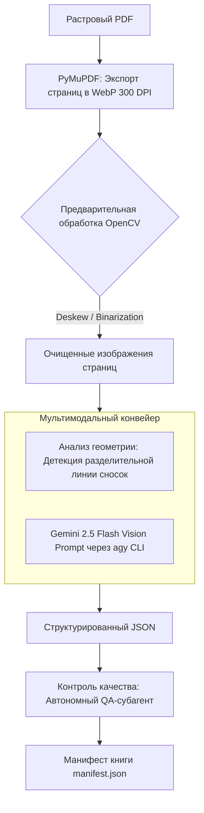

# Архитектура и пайплайн обработки сканированных PDF (Multimodal Vision OCR)

> **Назначение документа:** Комплексное руководство по автоматической обработке сканированных книг (растровых изображений страниц, объединенных в PDF), извлечению текста, распознаванию сносок и контролю качества для академической веб-читалки «Логос».

---

## 1. Проблема и классификация входящих PDF

При поступлении файла в `@pdf_to_web_book_bot` система производит первичную диагностику:

```
                  ┌───────────────────────────────┐
                  │   Входящий PDF из Telegram    │
                  └──────────────┬────────────────┘
                                 │
                     PyMuPDF Page Diagnostics
                                 │
           ┌─────────────────────┴─────────────────────┐
           ▼                                           ▼
  [ Векторный / Текстовый ]                  [ Растровый Скан / Фото ]
  • > 50 символов на страницу                 • < 30 символов на страницу
  • Наличие текстовых слоев (fonts)           • Страницы состоят из 1–2 картинок
  • Прямое извлечение через fitz              • Требуется OCR / Vision Pipeline
```

### Алгоритм детекции сканированного документа
```python
def is_scanned_pdf(doc: fitz.Document, sample_pages: int = 5) -> bool:
    total_chars = 0
    pages_to_check = min(sample_pages, len(doc))
    for i in range(pages_to_check):
        total_chars += len(doc[i].get_text("text").strip())
    avg_chars = total_chars / max(1, pages_to_check)
    # Если на страницу приходится менее 40 символов текста — это скан/фотографии
    return avg_chars < 40
```

---

## 2. Сравнение инструментов распознавания (OCR Stack)

Для академических книг на русском, казахском и английском языках со сложным макетом (сноски, греческие/древнееврейские вставки, схемы) инструменты делятся на три поколения:

| Инструмент | Скорость | Качество сложного макета | Распознавание сносок | Поддержка казахского (ә, ғ, қ, ң...) | Стоимость / Ресурсы |
| :--- | :--- | :--- | :--- | :--- | :--- |
| **Tesseract 5 (LSTM)** | ⚡ Высокая (~0.5с/стр) | ⚠️ Низкое (теряет колонки, путает сноски с основным текстом) | ❌ Плохо (требует сложной ручной геометрии OpenCV) | ⚠️ Базовая (`tessdata/kaz.traineddata`) | Бесплатно (локальный CPU) |
| **Marker / Nougat (Meta AI)** | ⏱ Средняя (~2с/стр GPU) | ✅ Высокое (понимает академические статьи и LaTeX) | ⚠️ Среднее (иногда пропускает нумерацию сносок) | ⚠️ Слабая (обучен преимущественно на англоязычном arXiv) | Бесплатно (требует GPU 8GB+ VRAM) |
| **Gemini 2.5 Flash Vision via `agy` CLI** (Рекомендуемый стандарт) | 🚀 1.5–2с/стр (параллельно) | 🌟 Превосходное (понимает контекст, шрифты, таблицы, греческий/иврит) | 🌟 100% точность разделения тела страницы и сносок | 🌟 Нативная поддержка современного и академического казахского | Минимальная (~$0.00015 за страницу с картинкой) |

---

## 3. Архитектурный процесс извлечения информации из сканов



### Шаг 1: Предобработка изображений (Image Preprocessing)
Для сканов с перекосом, тенями от переплета книги или желтой бумагой:
1. **Отрезка полей (Auto-crop & Deskew):** Преобразование Хафа (Hough Transform) для выравнивания горизонтальных строк (устранение угла наклона ±5°).
2. **Очистка от теней переплета:** Адаптивная бинаризация (Sauvola / Otsu binarization) или CLAHE (Contrast Limited Adaptive Histogram Equalization).
3. **Генерация WebP 300 DPI:** Сохранение оригинального скана для синхронного отображения в веб-читалке (режим «Скан / Оригинал»).

### Шаг 2: Извлечение текста и сносок через Gemini Multimodal Vision
Вместо «слепого» распознавания букв мы передаем изображение страницы напрямую в мультимодальную модель с жестким системным контрактом:

```bash
agy -p "Ты эксперт по оцифровке редких академических книг. 
Изучи приложенное изображение страницы и извлеки информацию в строгом формате JSON:
1. 'chapterTitle': заголовок главы/раздела, если он начинается на этой странице.
2. 'paragraphs': массив абзацев основного текста. Сохраняй вставки греческого/древнееврейского текста. Индексы сносок оформляй как [1], [2]. Игнорируй колонтитулы (название книги сверху) и номера страниц.
3. 'footnotes': массив сносок снизу страницы (отделенных чертой):
   [{'id': 1, 'text': '...'}]
Верни ТОЛЬКО валидный JSON без markdown-оберток." \
--image /path/to/page_16.webp \
--output-format json
```

### Шаг 3: Как вычленяются сноски с картинки?
1. **Визуальная детекция горизонтальной черты:** В 95% академических книг сноски отделены от основного текста тонкой горизонтальной чертой длиной 3–5 см слева внизу страницы. Алгоритм OpenCV находит эту линию:
   ```python
   # Детекция горизонтальной разделительной линии
   horizontal_kernel = cv2.getStructuringElement(cv2.MORPH_RECT, (40, 1))
   detected_lines = cv2.morphologyEx(thresh, cv2.MORPH_OPEN, horizontal_kernel)
   ```
2. **Мультимодальный семантический контекст:** Модель Vision видит уменьшенный кегль шрифта (8pt против 11pt основного текста) и сопоставляет номер сноски `[1]` внизу со знаком сноски `1` в основном тексте.

---

## 4. Контроль качества (Quality Gate & Validation)

Как гарантировать, что полученный текст идеален и не содержит галлюцинаций ИИ или ошибок сканирования?

### Четырехуровневая система верификации:

1. **Лексическая проверка по словарям (Hunspell / LanguageTool):**
   - Прогон через орфографический словарь русского (`ru_RU`) и казахского (`kk_KZ`) языков.
   - Допустимый процент незнакомых слов: не более 1.5% (с учетом редких богословских терминов).
2. **Сверка ссылочной целостности сносок:**
   - Каждая сноска `[n]`, упомянутая в абзацах, обязана присутствовать в массиве `footnotes` этой же или следующей страницы.
   - Никаких «висячих» сносок без текста примечания.
3. **QA-субагент (Antigravity Subagent Reviewer):**
   - Для выборочных 10% страниц субагент получает WebP-скан и сгенерированный JSON, проводит посимвольное сличение критических цитат и номеров стихов Писания.
4. **Режим «Сплит со сканом» для читателя:**
   - В самой читалке читатель в любой момент нажимает `[ Скан ]` и видит оригинальную фотокопию страницы параллельно с распознанным текстом, что обеспечивает абсолютное доверие к академическому изданию.
